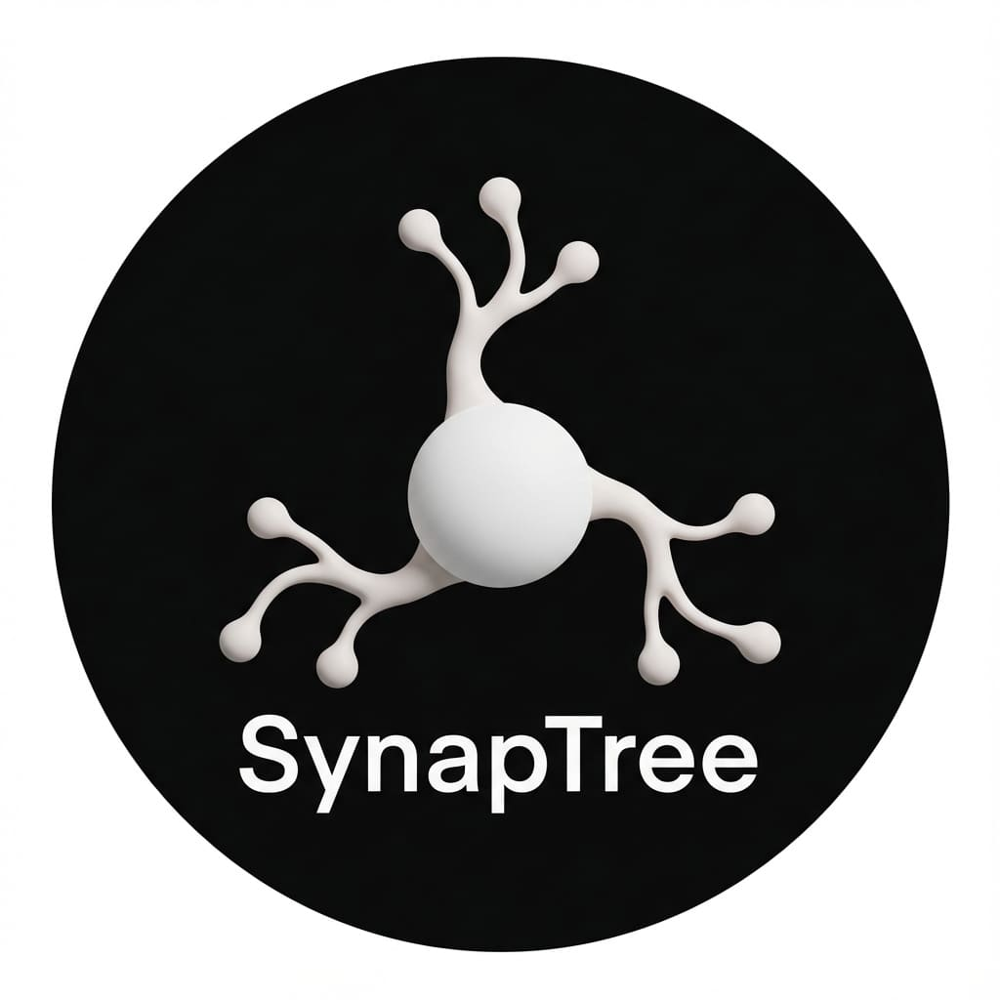

# SynapTree 0.0.7

**Visualize your workspace like a neural network.**  
SynapTree transforms your project's file structure into a stunning, interactive 3D Force-Directed Graph.

## ✨ Features

### 🌌 Interactive 3D Visualization
- **Cell-like Visuals**: Nodes feature a semi-transparent, glass-like aesthetic with an inner pulsating core.
- **Context Menu**: **Right-click** any node to access a full menu:
    - **Set as Root**: Focus the graph on a specific directory.
    - **Create**: Add new files or folders directly from the 3D view.
    - **Rename/Delete**: Manage your files without leaving the graph.
- **Auto-Focus**: Opening a file in the editor automatically centers the camera on the corresponding node (Sync).
- **Navigation**: Click nodes to open files. Use the HUD Reset button to return to the root.

### 🧬 Real-time Git Integration
See your project's pulse at a glance. Nodes react to Git status with dynamic spectral auras:
- **Modified**: glowing **Gold/Orange** aura.
- **Untracked**: glowing **Green** aura.
- **Staged**: glowing **Bright Green** aura.
- **Ignored**: dimmed or excluded based on settings.

*Updates are processed in efficient batches to ensure smooth performance even in large repositories.*

### 🔍 Deep Search & Navigation
- **Search**: Press `Ctrl+F` (or `Cmd+F`) inside the graph to toggle the search bar.
- **Ripple Effect**: Matches emit a distinctive expanding ripple for easy location.
- **Cycle**: Use `<` and `>` buttons to jump between multiple search results.

### 🎨 Customization
- **Colors**: Customize directory and file colors via VS Code Settings.
- **Extension Maps**: Assign specific colors to file extensions (e.g., `.ts`, `.rs`).
- **Particles**: Adjust the speed and density of signal particles flowing through links.

## Usage

1.  Open the **SynapTree** view in the Activity Bar.
2.  **Left Click**: Rotate Camera / Open File.
3.  **Right Click**: Open Context Menu on Node / Pan Camera (on background).
4.  **Scroll**: Zoom.
5.  **Ctrl+F**: Search.

## Settings

- `synaptree.general.autoFocus`: Enable/Disable editor-to-graph synchronization.
- `synaptree.colors.directory`: Color for directory nodes.
- `synaptree.visuals.particleSpeed`: Flow speed of dependency links.

---

## 📦 Installation

Install via the VS Code Marketplace:
`ext install yoru.synaptree`

## 📄 License

MIT License. See [LICENSE](LICENSE) for details.

---
*Created with ❤️ by Yoru & Antigravity (Google DeepMind)*
