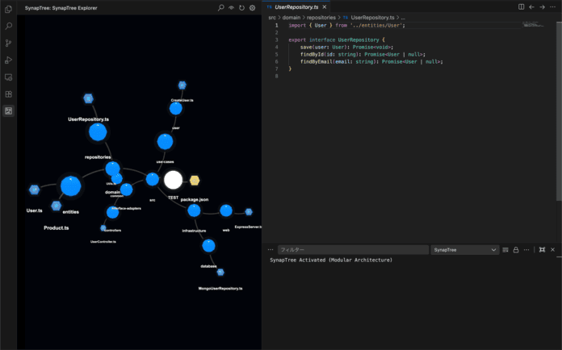
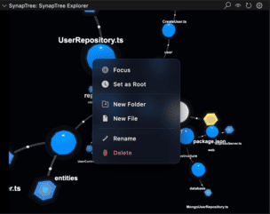
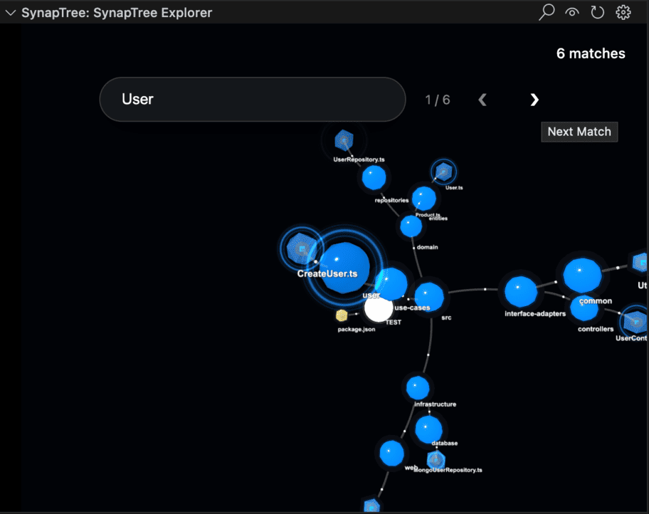

# SynapTree

**Visualize your workspace like a neural network.**  
SynapTree transforms your project's file structure into a stunning, interactive 3D Force-Directed Graph.

## ✨ Features

### 🌌 Interactive 3D Visualization

- **Node Icons**: Files display vivid, identifiable icons (JS, TS, CSS, Images, etc.) directly on the node.
- **Context Menu**: **Right-click** any node to access a full menu:
  - **Set as Root (Sidebar)**: Focus the graph on a specific directory.
  - **Open in Editor**: Quickly open and focus the file.
  - **Create**: Add new files or folders directly from the 3D view.
  - **Rename/Delete**: Manage your files without leaving the graph.
- **Auto-Focus**: Opening a file in the editor automatically centers the camera on the corresponding node (Sync).
- **Navigation**: Click nodes to open files. Use the HUD Reset button to return to the root.

### 📐 Flexible Layout

SynapTree isn't limited to the sidebar. Open it in a panel (e.g., below the Explorer) for a widescreen view of your architecture.

### 🧬 Real-time Git Integration

See your project's pulse at a glance. Nodes react to Git status with dynamic spectral auras:

- **Modified**: glowing **Gold/Orange** aura.
- **Untracked**: glowing **Green** aura.
- **Staged**: glowing **Bright Green** aura.
- **Ignored**: dimmed or excluded based on settings.

_Updates are processed in efficient batches to ensure smooth performance even in large repositories._

### ⚡️ Live File System Sync

The graph naturally evolves as you work.
- **Incremental Updates**: Adding, removing, or renaming files instantly updates the graph structure without a full reload.
- **Label Sync**: Toggle file labels on/off with perfect synchronization.

### 🎯 Focus & Filter

Right-click any folder to **Set as Root**. Isolate specific modules or layers (e.g., `src/domain`) to focus on what matters.

### 🔍 Deep Search & Navigation

- **Search**: Press `Ctrl+F` (or `Cmd+F`) inside the graph to toggle the search bar.
- **Ripple Effect**: Matches emit a distinctive expanding ripple for easy location.
- **Cycle**: Use `<` and `>` buttons to jump between multiple search results.
- **Breadcrumbs**: Track your current location with an interactive path bar at the bottom.

### 🎨 Customization

- **Colors**: Customize directory and file colors via VS Code Settings.
- **Extension Maps**: Assign specific colors to file extensions (e.g., `.ts`, `.rs`).
- **Particles**: Adjust the speed and density of signal particles flowing through links.

## 🕹️ Controls (Mouse Operation)

| Action     | Control                     | Description                                       |
| :--------- | :-------------------------- | :------------------------------------------------ |
| **Rotate** | **Left Click + Drag**       | Rotate the camera around the current center.      |
| **Pan**    | **Right Click + Drag**      | Move the camera horizontally or vertically (Pan). |
| **Zoom**   | **Scroll Wheel**            | Zoom in and out.                                  |
| **Select** | **Left Click (Node)**       | Focus on the node and open the file.              |
| **Menu**   | **Right Click (Node)**      | Open the context menu for the node.               |
| **Reset**  | **Left Click (Background)** | Clear current selection and highlighting.         |

## 🚀 What's New in 0.1.2

- **Live FS Sync**: Implemented a true real-time file system watcher. The graph now updates incrementally (node-by-node) for file creation/deletion, eliminating full reloads.
- **Bug Fix**: Fixed label visibility synchronization issues.
- **Node Icons**: Files display their respective file type icons directly on the node.

## Settings

- `synaptree.general.autoFocus`: Enable/Disable editor-to-graph synchronization.
- `synaptree.colors.directory`: Color for directory nodes.
- `synaptree.visuals.particleSpeed`: Flow speed of dependency links.
- `synaptree.config.general.ignorePatterns`: Configure files/folders to exclude from the graph.

---

## 📦 Installation

Install via the VS Code Marketplace:
`ext install yoru.synaptree`

## Credits

This extension uses icons from [Material Icon Theme](https://github.com/PKief/vscode-material-icon-theme), licensed under the MIT License.

## License

MIT License. See [LICENSE](LICENSE) for details.

---

_Created with ❤️ by Yoru & Antigravity (Google DeepMind)_
